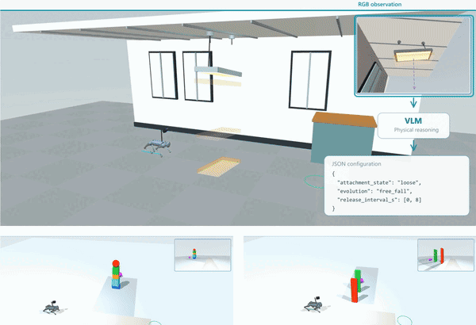

# PSS: Predictive Semantic Safety

PSS combines visual physical forecasting with backup-CBF control for MuJoCo Go1
navigation. Code-as-World predicts hazard motion, RGB-D observations provide
geometry, and the safety filter adjusts navigation commands around predicted occupancy.

[Project page](https://www.taekyung.me/pss) · [Demos](#demos) · [Benchmarks](#benchmarks)

<p align="center">
  
</p>

## Features

- Visual forecasting, geometric occupancy tubes, and predictive safety filtering.
- Ceiling, domino, and stack scenarios, plus active avoidance demos.
- Plain CBF, Backup CBF, and OmniVLA comparisons with paired benchmark tools.
- Calibration workflows and reusable command-line and Python APIs.

## Installation

Python 3.10 or 3.11. PSS model inference requires Linux and a CUDA GPU.

```bash
git clone https://github.com/AlKeshi/predictive-semantic-safety.git
cd predictive-semantic-safety
python3.11 -m venv .venv
. .venv/bin/activate
python -m pip install --upgrade pip
python -m pip install -e '.[dev]'
pss doctor
```

On Windows, create the environment with `py -3.11 -m venv .venv` and activate
with `.venv\Scripts\Activate.ps1`. On headless Linux, set `MUJOCO_GL=egl` and
`PYOPENGL_PLATFORM=egl` before camera-based runs.

## Repository layout

| Directory | Contents |
| --- | --- |
| [`pss/`](pss) | Predictors, safety filters, calibration, and simulation |
| [`demos/`](demos) | Demo launcher, recipes, and MuJoCo environments |
| [`benchmarks/`](benchmarks) | Evaluation and result summaries |
| [`datagen/`](datagen) | Benchmark cases and scenario generation |
| [`tests/`](tests) | Regression tests |

## Demos

```bash
pss demo --list
pss demo backup_cbf/stack-b --output results/baseline --render
```

PSS and `active/on` require the model setup below. Baseline CBF demos need no model.

<details>
<summary>PSS setup</summary>

Recommended: an NVIDIA GPU with BF16 support and at least 24 GB VRAM. Run both
terminals from the checkout on the same GPU node.

**Terminal 1:** install and start the model in its own environment.

```bash
python3.11 -m venv .venv-gpu
.venv-gpu/bin/python -m pip install --upgrade pip
.venv-gpu/bin/python -m pip install --group gpu
.venv-gpu/bin/python -m pss checkpoint --directory checkpoints/code-as-world
export VLLM_WORKER_MULTIPROC_METHOD=spawn OMP_NUM_THREADS=1
.venv-gpu/bin/python -m pss serve \
  --model "$PWD/checkpoints/code-as-world" --queue "$PWD/results/inference-queue" \
  --gpu-memory-utilization 0.82
```

**Terminal 2:** connect the simulator and run a demo.

```bash
. .venv/bin/activate
export PSS_INFERENCE_BACKEND=vllm-router
export PSS_INFERENCE_QUEUE="$PWD/results/inference-queue"
export MUJOCO_GL=egl PYOPENGL_PLATFORM=egl OMP_NUM_THREADS=1 OPENBLAS_NUM_THREADS=1
pss wait --queue "$PSS_INFERENCE_QUEUE" --timeout 600
pss demo pss/ceiling-a --model checkpoints/code-as-world --output results/ceiling --render
pss demo active/on --model checkpoints/code-as-world --output results/active --render
```

The example reserves 82% of GPU memory. Adjust `--gpu-memory-utilization` to
leave room for rendering and other GPU processes.

Keep the model running across demos. Use a fresh queue when restarting it.
Simulation pauses during model calls.

</details>

<details>
<summary>OmniVLA setup</summary>

Use a separate Linux/Python 3.10 environment and the pinned source and checkpoint:

```bash
python3.10 -m venv .venv-omni
.venv-omni/bin/python -m pip install --upgrade pip
.venv-omni/bin/python -m pip install -e '.[omnivla]'
git clone https://github.com/NHirose/OmniVLA.git third_party/OmniVLA
git -C third_party/OmniVLA checkout 5182600cb4a9ee07684e17cdd2a6cbafc56b8a68
.venv-omni/bin/python -c "from huggingface_hub import snapshot_download; snapshot_download('NHirose/omnivla-original', revision='e36a84d4923c041149d441f93f3bdb7092bb5f07', local_dir='checkpoints/omnivla')"
.venv-omni/bin/python -m pss demo omnivla/ceiling \
  --omnivla-source third_party/OmniVLA --omnivla-checkpoint checkpoints/omnivla \
  --output results/omni --render
```

</details>

Use a new output directory for each run. `--render` saves video; `--duration 2`
runs a short diagnostic. Available scenes and settings are in
[`demos/recipes.json`](demos/recipes.json); environments are in [`demos/scenes`](demos/scenes).
All commands accept `--help`.

## Benchmarks

```bash
pss scenes --list
pss benchmark --method backup_cbf --case stack_00_r00 --output results/benchmark
pss summarize results/benchmark
```

Use `plain_cbf`, `backup_cbf`, `omnivla` or `pss`. Learned methods use the same model
options as demos. PSS benchmarks require a calibration record matching the runtime.
Demos are qualitative and use different execution profiles. Summaries count completed
runs; report missing attempts separately. Contact-free and goal-reaching are separate outcomes.

### Calibration

Prepare disjoint training and calibration sessions under one frozen pipeline.
Data acquisition is supplied separately; the [corpus validator](pss/calibration/data.py)
and [pipeline descriptor](benchmarks/identity.py) define the required format and runtime.
To export compatible acquisition traces and fit:

```bash
python -m pss.calibration.export acquisitions/train/*/calibration_trace.json --output training.json
python -m pss.calibration.export acquisitions/calibration/*/calibration_trace.json --output calibration.json
pss calibrate training.json calibration.json --delta 0.05
pss benchmark --method pss --case stack_00_r00 \
  --model checkpoints/code-as-world --output results/pss
```

Calibration computes the quantile and saves the matching record in `calibration_records/`.
PSS loads it automatically. Refit when the pipeline changes. 

## Python API

```python
from pss import load_case, run_benchmark, run_demo

run_demo("backup_cbf/stack-b", "results/api-demo", render=True)
run_benchmark(load_case("stack_00_r00"), "backup_cbf", "results/api-benchmark")
```

`pss` also exposes `Predictor`, `Forecast` and `SafetyFilter` for custom pipelines.

## Development

```bash
python -m pytest
python -m ruff check .
python -m ruff format --check .
python -m build
```

Add regression tests in `tests/` when changing behavior.

## Contributors and license

Contributors: [Salem Fradi](https://github.com/AlKeshi) · [Yanning Dai](https://github.com/YanningDai).
Code: [MIT License](LICENSE). Third-party robot assets retain their
[license notices](pss/sim/mujoco/assets/go1/NOTICE.md).

## Citation

If you find this repository useful, please consider citing our paper:

```bibtex
@misc{kim2026predictivesemanticsafetyvisual,
  title={Predictive Semantic Safety: From Visual Physical Reasoning to Safety-Critical Control},
  author={Taekyung Kim and Salem Fradi and Yanning Dai and Mateusz Ostaszewski and Jürgen Schmidhuber},
  year={2026},
  eprint={2609.34356},
  archivePrefix={arXiv},
  primaryClass={cs.RO},
  url={https://arxiv.org/abs/2609.34356},
}
```
